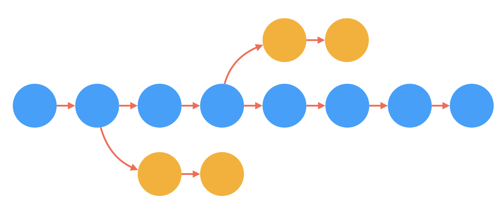
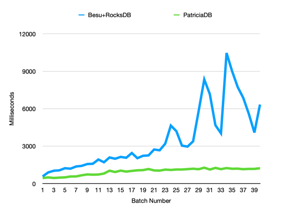
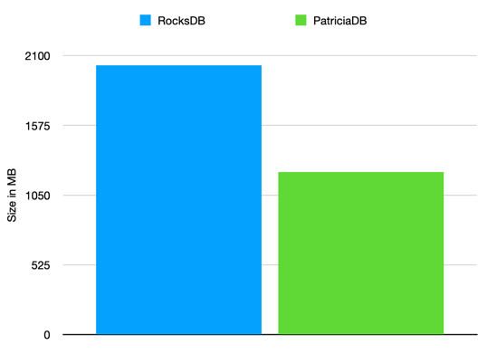

# PatriciaDB

PatriciaDB is fast and lightweight transactional key/value database built on the PatriciaMerkleTrie data structure.

Each transaction can handle an unlimited number of Tries, which are called storages in PatriciaDB.
For each storage, the database also compute and stores a cryptographic hash of each node of the trie.
PatriciaDB supports multiple Hashing algorithms and multiple formats, Ethereum included.

The Ethereum format is currently the default one. It means that when you
insert a defined set of key/values to a storage,
the root hash of the storage is the same
of any other Ethereum client.

PatriciaDB is not based on RocksDB likes many
Ethereum clients available on the market right now,
instead it uses a custom file system format
specifically designed to store the data of the nodes
efficiently and in a compact way.

For more information read our wiki:
https://github.com/PatriciaDB/PatriciaDB/wiki

## Basic Concepts
### 1. One block per Transaction
To make the development of a new blockchain easy,
we have developed PatriciaDB with one concept in mind:
**One Transaction per Block**

To start a new transaction you need the hash of the parent
block.

Similarly, when committing the changes, you can name
the newly created transaction with the hash of the new block.

```java
var transaction = patriciaDb.startTransaction(block.parentHash);
// Make you changes here
transaction.commit(block.hash);
```

When starting a new transaction, you don't have to start from the tail
of the chain, instead you can start from any transaction in your history.
### 2. Unlimited Number Trie/Storage
When you start a transaction, you can create and manipulate
and unlimited number of different storage.
A storage, in PatriciaDB, is a PatriciaMerkleTrie structures.

Each storage is uniquely identified by its own name.

```java
byte[] storageId = "state-storage".getBytes();

var transaction = patriciaDb.startTransaction(block.parentHash);

var storage = transaction.getOrCreateStorage(storageId);
storage.put(key, value);

transaction.commit(block.hash);
```

### 3. Keeps the history clear
The old transactions are kept inside an indexed history
tables and can be queried to get the metadata of the past
transactions, like the parent hash, creation time, etc.

### 4. Fast past transactions removal
Ethereum clients have often the need to delete the old states of trie
to free up disk memory. This is generally a very a heavy task.

Thanks to the underline file system implemented for PatriciaDB,
the old states/transactions can be removed very efficiently.

PatriciaDB keeps the list of new nodes and lost nodes for each transaction in
a compressed bitmap. This information can be used to delete
a transaction very efficiently.


### 5. Vacuum
If you have deleted many past transactions, you may want to recover
the spaced used from the disk. Running a Vacuum 
will recover all the unused space from the disk.


# Performance and space used
Early benchmarks suggests that PatriciaDB is between 5 to 10 times faster than the implementation provided by the Besu client (PatriciaMerkleTrie + RocksDB),
and it uses half of the space.

## Benchmarks
### Writes speed
Time to write a batch of 100K key/values. Comparing Besu+RocksDB with PatriciaDB. Lower is better.



### Space used
Writing 40 batches of 100K keys each. Besu+RockDB uses 2026mb after compaction,
while PatriciaDB just 1225mb.



# Example
At this stage PatriciaDB can only be tested as a library in embedded mode.

```java
        // Add BouncyCastle as a security provider to support Keccak-256
        Security.addProvider(new BouncyCastleProvider());

        var formatter = HexFormat.of().withLowerCase().withDelimiter(":");
        byte[] stateStorageId = "state-storage".getBytes();
        // random address
        byte[] address = {89, 65, 12, 79, 123, 94, 54, 23};
        // random value we want to store
        byte[] value = {13, 5, 9};

        // The hash of the genesis block
        byte[] genesisBlockHash = {87,21,90,12,53};

        // Let's create a new in-memory database
        PatriciaDB db = PatriciaDB.createInMemory();
        // Start a new transaction from an empty state
        var genesisTransaction = db.startTransaction();
        try {
            // Open or create a named storage id, in this case the storage is the global state storage.
            var stateStorageTrie = genesisTransaction.createOrOpenStorage(stateStorageId);
            stateStorageTrie.put(address, value);
            byte[] stateStorageRootHash = stateStorageTrie.rootHash();
            System.out.printf("Genesis storage-state root hash: %s%n", formatter.formatHex(stateStorageRootHash));
            genesisTransaction.commit(genesisBlockHash);
        } finally {
            genesisTransaction.release();
        }

        byte[] block1Hash = {89,95,12,0,15,78};
        // This time we start a transaction from a previous state.
        // We need to use the hash of the previous block.
        var block1transaction = db.startTransaction(genesisBlockHash);
        // A random new value we want to overwrite
        byte[] newValue = {13, 5, 9};

        try {
            var stateStorageTrie = block1transaction.createOrOpenStorage(stateStorageId);
            stateStorageTrie.put(address, newValue);
            // Get the hash root of the state storage
            byte[] stateStorageRootHash = stateStorageTrie.rootHash();
            System.out.printf("Genesis storage-state root hash at block1: %s%n", formatter.formatHex(stateStorageRootHash));

            block1transaction.commit(block1Hash);
        } finally {
            block1transaction.release();
        }

```

# Contribute
There are may ways you can contribute in the future, however at this stage of the project we can only accept feedback.
and no pull requests.

# Contacts
Join our discord server: https://discord.gg/3FG9GgHzsw
